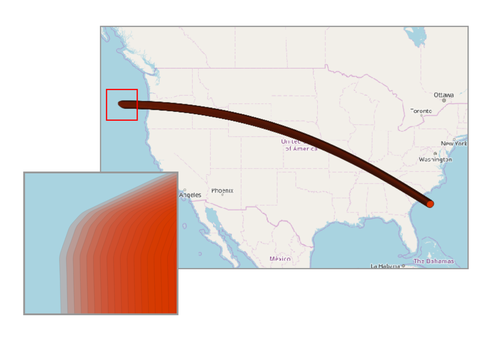
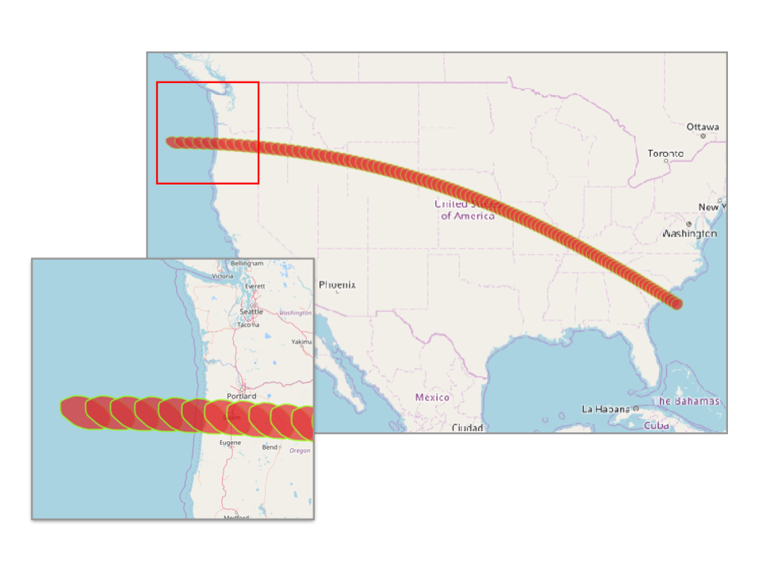
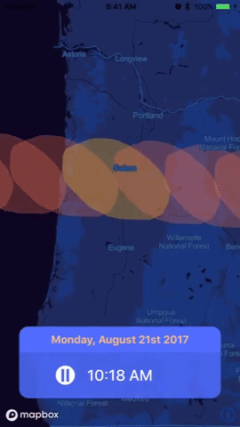

# Solar

Solar is an iOS demo application created to visualize the solar eclipse that occurred on [August 21st, 2017](https://en.wikipedia.org/wiki/Solar_eclipse_of_August_21,_2017). The application tracks the movement of the umbra along the path of totality.

# How to run it

Clone or download this repository and then run `pod install` within the directory of the project. Then, you can open and run the resulting `.xcworkspace` file in Xcode.

# How it was made

A combination of several tools was used to create this application. Below is a summary of what each tool was used for:

- **[NASA Scientific Visualization Studio](https://svs.gsfc.nasa.gov/4518)** - the source data for this project
- **[QGIS]** - for geospatial editing
- **[Tippecanoe](https://github.com/mapbox/tippecanoe)** - for tileset creation
- **[Mapbox Studio](https://www.mapbox.com/studio)** - for the creation of custom map styles
- **[Mapbox iOS SDK](https://www.mapbox.com/ios-sdk)** - for map development on the iOS platform
- **[Swift, Xcode 9](https://developer.apple.com/xcode/)** - for iOS development

## Step-by-step summary

### Inspecting the data

I started this project by downloading the `eclipse2017_shapefiles_1s.zip` file from the [NASA Scientific Visualization Studio](https://svs.gsfc.nasa.gov/4518). This zip file contained several different [shapefiles](https://en.wikipedia.org/wiki/Shapefile) but in this case I chose to use the `umbra17_1s` file which according to NASA, consists of the following data:

> Contains 6000 umbra shapes at one-second intervals from 17:12 to 18:52 UTC. These are high-resolution shapes with roughly 100-meter precision. The attributes for each shape include both a string representation of the UTC time and an integer containing the number of seconds past midnight of eclipse day.

After opening the data in QGIS, I had something that looked like this:

_Preview of raw data of the `umbra_1s` shapefile. The zoomed in region has a scale of 1:259,829._

The path consisted of oval-type shapes which represented the coverage by the umbra every second as the path of the eclipse made its way across the United States. Additionally, a handful of data attributes are associated with each umbra shape, including the time at which each umbra shape would cast its shadow on an underlying region.

As you can see in the above image, at low zoom levels it is impossible to distinguish individual umbra shapes. The size of this file was also quite large, so for this project I decided I wanted to only display umbra shapes every 60 seconds instead of every single second to bring down the size of this data and make it nicer to visualize.

### Preparing the data

To begin reducing the size of this shapefile to only include the umbra shapes I wanted, I first started by deleting any unnecessary attributes I wouldn't be using in the final project. I did this in QGIS by using the "Refactor fields" tool found within the processing toolbox. I deleted all unwanted fields, and was left with only the ones I knew I wanted to work with:

- `UTCSec` - the time of the day in UTC seconds the umbra shape exists
- `CenterLat`- the center latitude of the umbra shape
- `CenterLon` - the center longitude of the umbra shape

After I stripped the data of unwanted attributes, I needed to reduce amount of umbra shapes in the shapefile so that it would only contain umbra shapes at 60 second intervals instead of every single second. I selected every 60th umbra shape by using the selecting shapes with the following expression: `"UTCSec" % 60 = 0`.

This expression uses the `UTCSec` field on the shapefile to select every feature that, when divided by 60, results in a remainder of zero.

This results looked good:

To get this data on my map, I'd need to upload host this data on my Mapbox account so I could pull it into the iOS app later. Mapbox turns any geospatial data you upload into a [tileset](https://www.mapbox.com/help/define-tileset/), and in that process it defines its own [zoom extent](https://www.mapbox.com/help/define-zoom-extent/) of the tileset. So, if you uploaded a tileset it might determine that your data looks best between zoom levels 3 and 8, for example. 

I wanted to have more control over the zoom extent my data would have, so I converted my shapefile to GeoJSON and used Tippecanoe to [define the zoom extent](https://github.com/mapbox/tippecanoe#zoom-levels) I wanted my tileset to have.

After going through Tippecanoe, my data was converted to MBTiles format. I then uploaded this to my Mapbox account, finalizing the data preparation process. Next up was to get the iOS application up and running!

## Setting up the iOS application

I started setting up the iOS application by creating a single view application and including the Mapbox iOS SDK via CocoaPods. While I won't go into the small details about the code, here are the main components of the application:

1) The interface

The interface for this application is divided into two main parts - the map and the UIView containing supporting information. The UIView contains a pause/play button and also a label that would eventually display the time at which the umbra would appear over a given region.

2) Creating the map and adding the data 
- I created a custom map style in Mapbox Studio to apply a unique color palette to my map. Mapbox allows you include custom data at runtime, so I also added an `MGLFillStyleLayer` referencing the tileset source I uploaded earlier.

2) Animating the map movement

To move the map along the path of the umbra shapes, I first created an integer variable called `utcSecTime` that represented the `UTCSecTime` value of the first umbra shape. 

Then, I ran a timer that calls a function every second called `tick()`. This function does a few things:

  1) For every time `tick()` is called, the `utcSecTime` variable is increased by 60. 
  2) The `MGLFillStyleLayer` is selectively styled to only highlight the feature whose `UTCSecTime` attribute matches the `utcSecTime` variable created in the application. Because the umbra features are spaced at 60 second intervals, eventually all the features are highlighted when the timer is completed.
  3) For the feature that is currently being highlighted, I can also access the `CenterLat` and `CenterLon` attributes of the selected feature. Using this, I can change the map camera's center, and the map appears to move across the united states, highlighting each umbra shape in the center of the map along the way.
  4) Within this function, I also convert the `utcSecTime` to a readable time format and display it on a label to show the time at which each umbra shape will exist.
  
Put it all together, and it looks something like this:

# The End

This was a pretty fun demo to make, and I ended up doing a write-up of it on the [official Mapbox blog](https://blog.mapbox.com/visualizing-the-2017-solar-eclipse-with-the-mapbox-ios-sdk-8cca37fc11b2). Feel free to fork this project and make it your own. Questions? [Twitter](https://twitter.com/capnbrbsa) is usually a good place to reach me.

